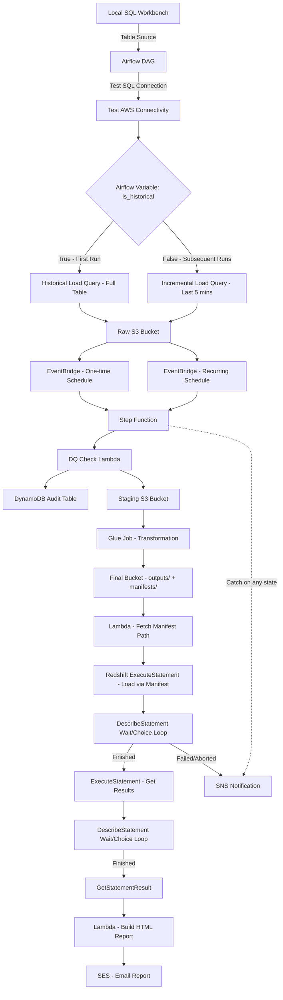

# AWS Data Pipeline: Historical & Incremental Load with DQ Checks, Glue Transformation & Redshift Reporting

An end-to-end serverless data pipeline built on **Apache Airflow**, **AWS Step Functions**, **AWS Glue**, **AWS Lambda**, **Amazon Redshift Serverless**, and **Amazon S3**, orchestrating both **historical** and **incremental** data loads with built-in Data Quality (DQ) checks, audit logging, and automated email reporting.

---

## 📐 Architecture Overview

---

## 🪣 S3 Bucket Structure

### 1. Raw Bucket
| Folder | Purpose |
|---|---|
| `incremental_data/` | Stores incremental extracts (data inserted in the last 5 minutes) |
| `historical_data/` | Stores the full historical extract (first run only) |
| `lambda_check_success_indicator/` | Stores a 0-byte marker file once DQ checks pass, signaling downstream jobs to proceed |
| `file_schema/` | Stores the expected schema definition (all expected columns) used by the DQ check Lambda |

### 2. Staging Bucket
| Folder | Purpose |
|---|---|
| `incremental_data/` | Destination for incremental files (moved from raw) |
| `historical_data/` | Destination for historical files (copied from raw) |

### 3. Final Bucket
Initially empty. Populated after pipeline execution with:
| Folder | Purpose |
|---|---|
| `manifests/` | Manifest files listing newly added output file paths |
| `outputs/` | Repartitioned (2 partitions), transformed data from the Glue job |

---

## 🔄 End-to-End Workflow

### 1. Local Development & Source
- Data resides in a local **SQL Workbench** table, used as the source system for extraction.

### 2. Airflow Orchestration
The Airflow DAG performs the following steps in order:
1. **Test local SQL connection**
2. **Test AWS connectivity**
3. **Determine load type** using an **Airflow Variable** (not a plain in-code variable) that stores a boolean flag:
   - **First run:** the variable does not exist yet → defaults to `True` (Historical Load) via an if/else check.
   - **Historical Load (`True`):** runs a query that pulls the **entire table**.
   - **Subsequent runs:** the variable is updated to `False` → runs a query that pulls only data **inserted within the last 5 minutes** (Incremental Load).
4. Based on the load type, the extracted data is written to the corresponding folder (`historical_data/` or `incremental_data/`) in the **Raw** bucket.

### 3. EventBridge Triggers
- **One-time schedule** → triggers the pipeline for the **Historical Load**.
- **Recurring schedule** → triggers the pipeline for the **Incremental Load**.
- Both pass a payload indicating the **load type**, which triggers the **Step Function**.

### 4. Step Function: State Machine

#### a. DQ Check Lambda (First State)
- Picks the **latest file** from the relevant Raw folder (based on load type).
- Validates the file against the expected schema defined in `file_schema/`.
- Logs the check result (**success/failure**) to a **DynamoDB audit table**.
- On success:
  - Writes a **0-byte marker file** to `lambda_check_success_indicator/`.
  - Moves the file (Incremental) or copies the file (Historical) from **Raw → Staging**.

#### b. Glue Job — Transformation
- Verifies the presence of the 0-byte success indicator file before proceeding; if absent, the job **raises an exception and fails**.
- Applies all required transformations.
- Writes processed data to the **Final bucket's `outputs/`** folder using `repartition(2)`.
- Generates a corresponding **manifest file** (listing the newly added output file paths) in the **Final bucket's `manifests/`** folder.

#### c. Lambda — Manifest Resolver
- Sits between the Glue job and the Redshift load step.
- Fetches the **latest manifest file** and passes its path to the next state.

#### d. Redshift Serverless — ExecuteStatement (Load)
- Loads the new data into the Redshift Serverless table using the **manifest file** (COPY via manifest).

#### e. DescribeStatement Wait/Choice Loop (Load Status)
- Polls the query status using `DescribeStatement`:
  - **FINISHED** → proceed to the next state.
  - **FAILED / ABORTED** → send failure notification via **SNS**.
  - **Any other state** → `Wait` → re-check via `DescribeStatement` (loop).

#### f. Redshift Serverless — ExecuteStatement (Get Results)
- On successful load, executes a query to **fetch the results**, using the same polling pattern as above:
  - **DescribeStatement → Wait/Choice loop → FINISHED**

#### g. GetStatementResult
- Retrieves the final result set using the `ExecuteStatement` ID from the "Get" query.

#### h. Lambda — HTML Report Builder
- Formats the retrieved result set into an **HTML report**.

#### i. SES — Email Report
- Sends the HTML report via **Amazon SES**.

### 5. Error Handling
- A **common SNS topic** is attached as a **Catch** handler on **every state** in the Step Function, ensuring failures at any stage trigger an email notification.

---

## 🛠️ Tech Stack

| Layer | Service/Tool |
|---|---|
| Orchestration (Extraction) | Apache Airflow |
| Orchestration (Pipeline) | AWS Step Functions |
| Storage | Amazon S3 (Raw, Staging, Final) |
| Compute / Transformation | AWS Glue |
| Data Quality & Utility Logic | AWS Lambda |
| Audit Logging | Amazon DynamoDB |
| Scheduling / Event Trigger | Amazon EventBridge |
| Data Warehouse | Amazon Redshift Serverless |
| Notifications | Amazon SNS |
| Email Reporting | Amazon SES |

---

## 📌 Key Design Highlights
- **Stateful load-type control** via Airflow Variables (not hardcoded), enabling automatic historical → incremental transition after the first run.
- **DQ-gated pipeline**: downstream Glue transformation is blocked unless a DQ success indicator (0-byte file) is present.
- **Manifest-driven Redshift loads** to ensure only newly processed files are ingested.
- **Polling loops (Wait/Choice)** for both load and result-fetch stages of Redshift `ExecuteStatement`, avoiding synchronous blocking.
- **Centralized failure handling** via a single SNS topic attached as a Catch block across all Step Function states.
- **End-to-end auditability** through DynamoDB logging of DQ check outcomes.

---

## 📧 Notifications
- **Failure alerts:** Sent via SNS whenever any Step Function state fails, or when a Redshift query is `FAILED`/`ABORTED`.
- **Success report:** An HTML summary of the loaded/queried data is emailed via SES upon successful completion.
